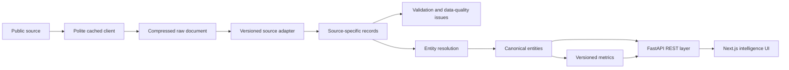

# Architecture plan

## Principles

1. Preserve source evidence before parsing. Every retrieval is content-hashed, gzip-compressed, timestamped, and tied to its parser version.
2. Keep source records separate from canonical records. Reconciliation proposes matches and records conflicts; it never overwrites provenance.
3. Treat incomplete history as normal. APIs and UI return explicit completeness states and omit metrics whose inputs are absent.
4. Version parsers and calculations independently. Historical layout changes can route to a parser version without breaking later seasons.
5. Keep analytics reproducible. Each metric definition names inputs, formula, minimum sample, classification, and version.

## Runtime flow

FastAPI and Celery share SQLAlchemy models and PostgreSQL. Redis carries job state and caching. The frontend uses TanStack Query for server state, TanStack Table for sortable datasets, and Recharts for visualizations.

## Phase boundary

The checked-in implementation covers the initial Phase 1 foundation plus a thin vertical slice: source discovery, raw storage, UPIKE cumulative-stat parsing, idempotent season/game/player import, REST reads, and a dashboard. AAC/NAIA parsing remains blocked until their operators provide an automation-compatible public path or their access behavior changes.
