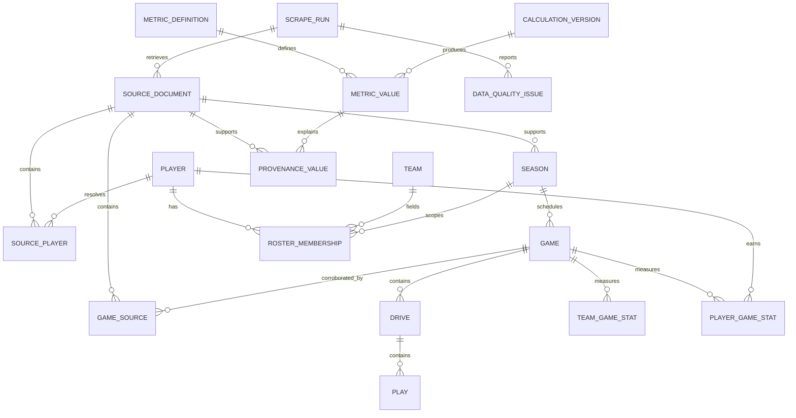

# Database entity-relationship design

The first migration implements the solid-line vertical slice below. Dashed groups describe the normalized target design for later phases.

Target domains also include schools, conferences, divisions, teams, seasons, venues, coaches, player aliases, positions, opponents, game periods, scoring events, possessions, participation, starters, penalties, turnovers, timeouts, rankings, standings, awards, reconciliation candidates, entity conflicts, and manual identity decisions.

All source facts carry the source, URL, source record identifier, retrieval time, parser version, and raw-document key. Canonicalization stores the selected fact and rule while retaining all source facts.
